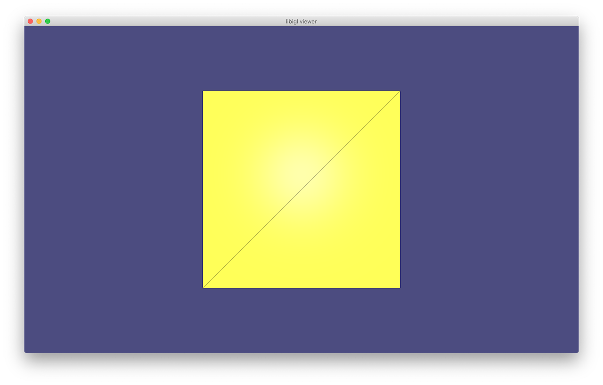

# libigl example project

A blank project example showing how to use libigl and cmake can be found
[here](https://github.com/libigl/libigl-example-project). Feel free and
encouraged to copy or fork this project as a way of starting a new personal
project using libigl.

## See the tutorial first

Then build, run and understand the [libigl tutorial](./tutorial.md).


## Dependencies

The only dependencies are stl, [libigl](https://libigl.github.io/), Eigen3 (included in libigl) and
the dependencies of the `igl::opengl::glfw::Viewer`.

We recommend to install libigl using git via:

```bash
git clone https://github.com/libigl/libigl.git
```
Or use an existing version of libigl, more on that see [Compile](./example-project.md#compile).

If you have installed libigl at `/path/to/libigl/` then a good place for the example project is right next to libigl:

```bash
git clone https://github.com/libigl/libigl-example-project.git /path/to/libigl-example-project
```


## Compile


Compile this project using the standard cmake routine:

```
mkdir build
cd build
cmake ../
make
```
Just make sure that cmake is able to find libigl.
To do so cmake checks a few directories and environment variables, see [FindLIBIGL.cmake](https://github.com/libigl/libigl-example-project/blob/master/cmake/FindLIBIGL.cmake).
If your libigl version is locate elsewhere, either set one of the ENVs or add `LIBIGL_INCLUDE_DIR` when you issue cmake:
```bash
cmake ../ -DLIBIGL_INCLUDE_DIR=/path/to/libigl/include
```

This should find and build the dependencies and create a `example_bin` binary.

## Run

From within the `build` directory just issue:

```bash
./example_bin
```

A glfw app should launch displaying a 3D cube.


